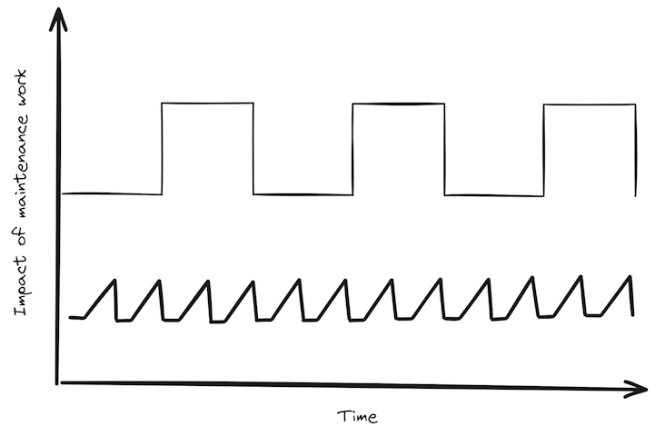
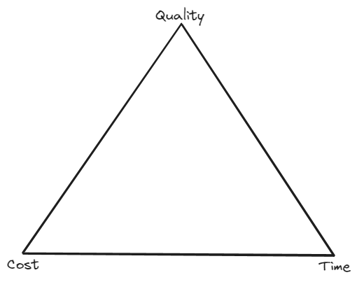

# Chapter 6: Modern strategies

In the last chapter we examined some of the simplest and most ancient military tactics and found plenty of uses for them in modern technology organizations.

In this chapter we’ll examine more modern tactics starting with Machiavelli, moving on to Napoleon,  Clauswitz and Jomini and finishing up with a look at US Marine Corps tactics.

## Make a habit of solving problems

Machiavelli has much to teach the tactician, in his book, Letters to the Prince, written in 1513 Machiavelli attempts to make a science of leadership by distilling certain laws from his observations, his experience as a diplomat, his study of history and his common sense. While Machiavelli was discussing what it meant to lead a city state in medieval Italy there are lessons for the modern tactician here too.

>The Romans therefore on seeing troubles far ahead, always strove to avert them in time and never permitted their growth merely for the sake of avoiding war, well knowing that the war would not be prevented, and that to defer it would only be an advantage to others…

As tacticians our war is with the problems we are trying to solve. Many organizations choose to put off resolving problems in the hope that those problems don’t prove too costly later. The lesson here is to actively manage the risks that face our organizations and their initiatives. Actively managing risks doesn’t mean just listing them on a risk register but also choosing how and when to respond to them.

The benefits of technology come with some costs. One of those costs is technical hygiene. Software needs to be kept up to date, vulnerabilities need to be resolved, infrastructure capacity needs to be optimized, tests need to be pruned and a whole host of other hygiene tasks need to be addressed. Everyone of these problems starts out small and seemingly harmless. A small delay in resolving any of them will most likely go unnoticed. Immature organizations will just leave them. They present no measurable impact today and so they can wait. There might even be a debate where someone will draw diagrams like this:

 
 

The ‘artist’ will be attempting to have a serious discussion about the team and the company culture and whether ‘stop the world’ type fixes are better or worse than teams expending some consistent effort of keeping their estate maintained with regular effort.

These debates will usually conclude that it’s better, at this time, for the business, to put resolving these problems on hold for now. It’s more important that the business increase revenue, or grow the teams, or deliver a new feature or whatever it might be. Meanwhile these hygiene tasks mount up. The tests aren’t managed and the pipelines start to slow down. The software falls a major version behind and there are now breaking changes between the version in use and the new version. The vulnerabilities start mounting up. The organization might hire a DevOps engineer to work on speeding up the pipeline. They might start discussing what a plan might look like to upgrade the software. Security starts highlighting how out of date the software is and highlighting known vulnerabilities. All of these things require investigation, debate and maybe those drawings come out again.

Everyday this situation continues and the problems get more complicated and more expensive to resolve. Some people might bring up the opportunity cost of implementing time consuming resolutions to these problems. The problems continue to grow in number and complexity and include more and more breaking changes. If the organization is lucky progress slows to a halt and an investment case is made to solve the problems. Some capable people will have left the organization in frustration and now they need to bring in consultants to help and the cost of resolution is the opportunity cost of a 6-9 month period with no significant feature development plus several million in consultancy fees. If the organization is unlucky the lack of progress or an exploited vulnerability destroys the business.

There is no debate. There is no better time to upgrade software, resolve vulnerabilities, optimize infrastructure and actively manage the tests and the test runs than right now. Putting these hygiene tasks off, even for a day, is never to the organization’s advantage. Machiavelli knew this in 1513.

All of these are problems that should be faced immediately because they add friction to the organization every single day they exist and all it takes is one event that the organization has no control over to cause a disaster that threatens the organization’s existence.

The tactician can learn from the lesson that Machiavelli learned from the Romans. Don’t turn away from a difficult situation. As discussed previously it isn’t always right to tackle every problem head-on but it is necessary to tackle them and not shy away from them.

## Helping organizations with absent or poor leadership

In Chapter 5 of Letters to the Prince Machiavelli talks about a prince taking over a new territory that has been accustomed to its own rule and concludes:

> …therefore the surest way of holding them is either to destroy them, or for the conqueror to go and live there.

When an organization has operated without leadership or with significant leadership gaps for a significant period of time the staff will organize themselves around keeping out of trouble. When the strategist needs an organization like this to behave differently no amount of town hall meetings, discussions about organizational or technology principals or rewriting of job descriptions will change the organization's behavior. As Machiavelli points out there are two ways to change organizations like this: they can be destroyed or the strategist can work amongst them and change them from within.

In a modern context destroying an organization can just mean undermining the informal structures that have formed in the absence of leadership. This can be done in a number of ways. Key people can be performance managed into operating in a way that is more useful. Processes can be changed or removed completely and replaced. Both of these approaches require enormous time and effort from leadership, management with support from people teams.

A more sympathetic approach, that requires considerably less effort, is to live and work amongst those people in the organization and to demonstrate, by example, how leadership and change can help the people within the organization. The tactician must look for the anomalous behavior that causes people to behave in ways that seem contrary to their interests. Are they disabling tests in order to hit a deadline? Are they manually deploying software or manually modifying data? Are teams being disrupted by un-managed changing priorities? These are some of the places where the tactician can exert some leadership, insert themselves into the process and make the organization better in little ways and by this earn the credibility necessary to make larger changes.

## Of the duties of a prince in relation to military matters

In the first half of Letters to the Prince Machiavelli describes the different types of principalities that exist and describes how a prince might acquire and hold them citing numerous examples from history. At the start of the second half of his book he concludes:

>A prince then, should have no other thought or object so much at heart, and make no other thing so much his especial study, as the art of war and the organization and discipline of his army…

One of the follies of many modern organizations is that they maintain an idea that if only they can solve the latest problem they will be able to return to some sort of normal or business-as-usual (BAU) state. The very idea that there could be some normal, ground state that could ever be achieved in the 21st century is laughable. At the time of writing there is a new Artificial Intelligence innovation every week. There are calls to regulate AI but teams working for me right now are already using AI to automate all manner of menial or annoying tasks such as creating commit comments on code, writing documentation, or creating the first draft of regular expressions. New businesses and new business models are being created every day, taking advantage of new AI capabilities. Before that it was DevOps, before that it was the cloud, before that it was smartphones on and on it goes. There is no normal, there is no BAU if you find one start counting the days before a new start up disrupts your business or your customers start deserting you for a business that is solving the new problems they face.

The tactician needs to be constantly solving problems. Either they are addressing scaling or they are helping their teams to adapt to new ways of working or new technological advances or they are improving efficiency. They should be constantly automating toil. They need to ensure developments that have gone before don’t become tomorrow’s legacy that require a costly and time-consuming transformation programme.

**The tactician then, should have no thought or object so much at heart as the study of solving problems.**

Machiavelli goes on to say that the prince should learn the landscape of their principality and condition their body so that the prince can lead their military. He also describes how the prince should exercise their mind discussing hypothetical military situations and studying historical accounts.

The same is true for the tactician. The principality is replaced by the problem space. Hypothetical situations still need to be discussed with trusted confidants and peers. As modern day tacticians we have many more tools than these at our disposal. We have like Risks, Assumptions, Issues and Dependency (RAID) logs, software tests, vulnerability tools, penetration tests and chaos monkey implementations all to help us formulate and create solutions for hypothetical problems. Nothing prepares an organization for solving problems better than one that has optimized it’s flow of work so that nothing impedes their team’s progress.

## Whether the erection of fortresses, and many other things which princes often do, are useful or injurious

>It has never happened that a new prince has disarmed his subjects; on the contrary rather, if he has found them unarmed, he has armed them, and in that way has made them as it were his own, and made those faithful who before were suspect; whilst those who were loyal to him before will remain so, and this will convert his subjects into partisans and supporters

In organizations where the teams aren’t empowered to solve problems there is suspicion and doubt and dissatisfaction. In order to turn that organization into a high performing organization the teams need to be empowered with a combination of authority, technology, people, process, tactics and strategy. Those teams suspicious of the strategist or the transformation they are attempting to bring may not be immediately transformed into supporters of the programme or the strategist but they will be less suspicious and dissatisfied and from small acorns mighty oak trees grow.

>A prince who fears his own people more than he does foreigners should build fortresses; but he who has more cause to fear strangers than his own people should do without them.

If we equate physical landscape and territory to ideas and problem spaces then fortresses would be rules and inviolable principles.

When technology organizations demand a specific language choice to always be used for solving a specific type of problem they aren’t trying to protect themselves from disruption from their competitors. They are trying to protect themselves from problems their own people might create. Mandating a specific language for building backend services allows an organization to also mandate specific package versions that have been vetted by security and to execute a standard predefined test suite and use a repeatable model for capacity planning. All of these are solutions to problems that could be created by the teams within the organization building the software.

With that clarified Machiavelli's rule works as well for the us as it did medieval Italian princes. If we don’t fear problems caused by our people then we should have as few inviolable rules and principals as possible because that way the teams have the maximum freedom to choose the right solution to any problem they may face. If we fear that our people might create a problem for us then we should ensure they operate within well specified guidelines that we can use to secure that aspect of our problem space.

## Make a habit of solving problems (again)

Three hundred years after Machiavelli wrote his Letters to the Prince, Carl Von Clauswitz wrote: On War. Like Machiavelli before him Clauswitz was trying to create a science from something that was previously considered an art. This was the first time someone had tried to make a scientific analysis of war.

>War is a continuation of state policy by other means.

Clauswitz didn’t state this as a fact, he presented it as an opposing argument to a statement he had made earlier about a war being equivalent to a duel. However there is guidance for the tactician in this wisdom.

If our enemies are the problems we're trying to solve, then state policy would equate to our business strategy. Clauswitz' statement can be interpreted as:

**Solving problems is a continuation of business strategy by other means.**

If we take Machiavelli's statement:

>A prince then, should have no other thought or object so much at heart, and make no other thing so much his especial study, as the art of war and the organisation and discipline of his army…

And Clauswitz’s:

>War is a continuation of state policy by other means.

Then we get **Solving problems is business as usual.**

This philosophy is at the heart of what it means to to be a modern product and technology organization. This further reinforces that there is no calm, business-as-usual state that protects us from change, disruption and problem solving. The ultimate goal of the tactician in a modern organization should be to leave behind them an organization that looks for opportunity in every change and thinks of problems as their day-to-day business. It isn't aiming for some rest state where everyone gets to relax. Instead our organizations should be striving for a state where everyone is empowered to solve the problems the business and products face every day and have all the tools and resources they need so solving those problems isn't emotionally and psychologically exhausting.

## Utmost use of force

Clauswitz was bringing his years of experience, association with many great leaders and study of history and attempting to demystify the theory of war. In stating that the general should bring the utmost use of force he was contrasting that view with the question of why a general would bring less. His position being that there isn’t any advantage to using less than the full force required to achieve the desired result.

As with the general Clauswitz is instructing, there is no reason why the tactician wouldn’t assemble the exact skills and capabilities needed for achieving their desired outcome. This sounds obvious, and probably no one would disagree, but in many organizations assembling a cross-functional team with all the right knowledge and capability to solve can require a heroic effort of negotiation.

Consider improving the Search Engine Optimisation (SEO) of a site. This will require SEO knowledge and tools to test the effectiveness of the changes. The SEO team are often either in the Marketing department or associated with them and more usually act in a requester and reviewer capacity, testing the site and providing more requirements. The initiative will usually require someone who knows the tags used on the site and the exact definitions of those tags and what they are used for in the business intelligence and analytics capacity. Those people typically reside in a data and analytics team, these are often in entirely different departments from the engineers. Our new cross-functional SEO team will need some software engineers to make the necessary changes and a product manager to prioritize the work and communicate progress to stakeholders. The team will need some delivery management particularly if they need to make any changes that might impact other areas of the site.

Just getting these people out of their usual environments and associated with a new initiative will require negotiation with at least three director level people. Then the people themselves have to understand the new context they are working within and establish new ways of working. This sort of initiative requires much more frequent communication aimed at several different types of stakeholder than a usual team would require.

All of these hurdles stand in the way of bringing the utmost use of force to solving a common problem in a modern organization. If people and their capabilities are organized in such a way that it requires negotiation to bring their full capability to bear on a problem then the organization’s structure has been optimized for something other than solving problems.

One of the functions of the tactician should be holding up a mirror to the organization they are working within and asking the leadership if the teams are best organized for solving the problems the organization faces.

Clauswitz also observed:
>Keep the forces concentrated - no portion is to be separated from the main body unless called away by some urgent necessity.

This axiom relates to the utmost use of force but also speaks to the danger of context switching. Not only should the team be the right size and composition to tackle the problem they face but they mustn’t be distracted by other problems.

After all the negotiation required to bring a group of people together to solve a problem, it's not uncommon for one of the conditions of that negotiation, to be that one or two of the team members still have to resolve problems from their old remit. If you aren’t someone used to solving these sorts of problems that might seem reasonable. If a director is going to go to all the trouble of sparing one of their team members to help with this problem isn’t it reasonable that they can, at any time, call on that person to help their old team? No. As Clauswitz calls out here, it isn’t reasonable at all. This team should focus all of its attention and capability on solving the problem they have been tasked with. That way it gets solved as quickly as possible. Forcing some of the team to switch their focus to another problem, even for a short time, can have significant knock-on effects.

Organizations divide their forces all the time. Separating front-end and back-end and other teams. This creates opportunities for these teams to have different incentives. When they could be working together to achieve one set of goals. There is always the argument that teams with different skills require different management but that’s siloed thinking. Teams are motivated by solving problems, by making a difference. Teams and individuals can learn from each other and leaders without needing to be in the same management structure. However teams can’t even form to solve problems if they are divided from the other people they might work with to solve those problems.

## Few problems can be resolved forever

>The aim is to disarm the enemy… The result in war is never absolute.

The tacticians enemy is the problems facing their organization. The aim is to disarm the problem and ensure it can’t disrupt the business’ goals. The aim is not to destroy the problem entirely. Immature organizations often stop themselves from addressing problems until they find an ultimate solution that will solve problems once and for all. Some problems are inherent to the nature of technology. No solution will ever solve the problem of obsolescence. The goal should be to match the level of investment to solving the problem for long enough that it's worth the investment.

In my very first engineering lecture at university the head of the faculty presented us with the Iron Triangle and explained that engineers solve problems taking cost, quality and time into consideration.

A solution has to be good enough for an appropriate time period. Perhaps the solution only has to be good enough to get to the next problem. Perhaps the solution has to be good enough to justify another funding round or a due diligence by investors. Either way no solution will ever work forever.

>War is never an isolated act

Clauswitz was referring to the fact that wars don’t spring up overnight. Wars are one of the results of an accumulation of problems that include the strength of feelings of the people in the nations in question and a political object that makes war an acceptable cost to both nations' leaders.

This is equally true for the kinds of problems tacticians need to solve in modern technology organizations. The problems that require organizational restructuring, technical re-platforming, or radically new approaches don’t spring up overnight. They are accumulations of problems across multiple domains over significant periods of time. There will, usually, have been multiple attempts to solve these problems in-situ with varying degrees of success. Each partial solution will have left artifacts behind which may add to the current problems. The lesson for the tactician is not to accept a superficial examination of the problem. Sometimes a tactician also has to be an archeologist. Some problems don't make sense until you realize that there might be strata of problems and solutions laid on top of each other.

>War does not consist of a single instantaneous blow

Clauswitz was referring to the many factors that affect combat. Getting troops to the required locations, supplying them, discovering and dealing with hitherto unknown terrain and the uncertain actions of the enemy all prevent a war from being resolved in a single, pre-planned, combat.

The same is true for solving problems in modern technology organizations. It isn’t enough to discover a problem, plan a resolution and then execute the plan. Even if the general has made many calculations in his temple ere the battle is fought there will be unforeseen circumstances, plans will be disrupted by environmental factors outside the control of anyone in the organization. People, processes and technologies all change at different rates. In some cases changes have to be synchronized. The changes can’t just be made as needed, they will need communication plans which include preparatory communications, frequent status updates, announcements and then later messages about the efficacy of the changes and follow up communications describing future roadmaps.

The tactician needs to find some quick wins, ways to earn the confidence of the organization specifically to buy time for this extended, time consuming preparatory work. This requires maintaining a fine balance between making some immediate measurable improvements and laying the groundwork for larger scope changes.

>A second ground consists of the incomplete knowledge of circumstances.

Clauswitz was explaining different circumstances that might lead to a temporary cessation of hostilities. Clauswitz explains that a leader can only really know the condition and distribution of their own forces. The leader can have no perfect knowledge of their enemy, the condition of their forces and the exact nature of the terrain between them. Yet they have to act anyway. The same is true for the modern tactician. While our enemy, the problems we're trying to solve, is not a devious and cunning enemy, fully understanding the problem such that the resolution is a certainty is rare.

Knowing this the tactician must ensure the teams they are working with are able to respond well to problems. Unknown situations will occur and sometimes the tactician has to be engaged elsewhere. If the tactical approach falls apart the moment the tactician turns their back and a team hits a problem they haven’t planned for then it’s only a matter of time before the initiative fails.

This requires that the teams understand the tactics, in their specific context so they can continue with it for short periods of time unsupervised. The teams must understand the behaviors that will be rewarded and the sorts of behaviors they should avoid. This should be enshrined in a few key principals they can repeat to each other like a mantra to reinforce their spirits when things get difficult.

>Everything is very simple in war, but the simplest thing is difficult. These difficulties accumulate and create a friction which no man can imagine exactly who has not seen War,...

Any tactician, principal engineer or architect who has tried to help an organization with a technology stack that is 10 years old or older can probably imagine the nature of the friction that Clauswitz saw in war.

Organizations are very similar to complex organisms in that they have defense mechanisms, they can heal themselves, they can grow cancers and they can adapt to or resist change. It’s usually straightforward to understand why a specific change was embraced or resisted. It’s much more complicated trying to understand the mesh of adaptations and changes that were resisted and embraced over a longer period of time when looking at an organization in its current state.

All of these organism-like reactions can apply friction even in the cases where the organization adapts to change. The nature of the adaptation might cause friction to other changes detected in the environment.

This is one of the reasons why changes and communication about changes must be meticulously managed. Even if all this is done well the simplest things can become unexpectedly difficult. This is why a tactic, that is resilient to change, is important. There must be fallback plans in place. There must be solutions that can be downgraded from ideal to good enough to allow progress to continue to be made in the face of adversity or ambiguity. Momentum must be maintained, if that is lost then the organization is not going to be much better than it was before the transformation began.

# Technology problems are people problems, process problems are people problems...

Baron De Jomini, General and Aide-de-Camp of the Emperor of Russia, wrote in his book, The Art of War, published in 1838.

>…it is the morale of armies, as well as nations, more than any thing else, which makes victories and their results decisive.

Earlier in the book I stated that an organization must be prepared to execute a strategy. If a team lacks the tools, the time, the skills and experience to successfully implement a tactical approach then the strategy will likely not result in any lasting result. Baron De Jomini knew this and this is a lesson we need to take to heart as well. In some respects this is the hardest problem the tactician faces. The military learned this lesson a long time ago. Soldiers aren’t recruited and put straight into their teams, they have basic training and then more training in their specific fields. There is no equivalent of this in most modern technical companies. This requires that the tactician find a way to train and up-skill their people to prepare them for the problems they will have to face. If the tactician needs to get some quick wins in order to prove their credibility then they will need the ability to inject some skills and experience into their teams.

## Napoleonic Warfare and modern warfare

One of the reasons why Napoleon was so devastating during the early 1800s was a combination of tactics that came together to overwhelm his opponents. This included:

- Speed, mobility and surprise
- Devolution of missions to commanders.
- Multi-disciplinary fighting forces (Corps D'Armée)
- Deploying forces to multiple different fronts timed to arrive when they could surprise an enemy and force them to fight on multiple fronts.

The Corps D'Armée was a command structure that allowed a commander to lead multiple different types of forces including, infantry, cavalry, artillery and support units. The commander was then given a mission to achieve and expected to use their initiative and experience to achieve the mission.

Napoleonic warfare was characterized by "...its limitless variation and flexibility (https://www.napoleon-series.org/military-info/organization/c_armycorps.html).

It's partly from these strategies that Clauswitz distilled "Utmost use of force". With this combination of strategies Napoleon could put his forces exactly where he wanted them and rely on them to deploy themselves as well as they possibly could to achieve the mission.

What worked well for Napoleon works just as well in modern technology organizations. Trusted people able to execute any part of the mission using their own initiative, using multi-disciplinary or full-stack teams means they can overcome any obstacles.

Another advantage of multi-discipline software engineering teams is that they can create a visible impact with web components or pages so that senior leadership gain confidence in the team's ability to execute because they can see something for themselves.

# 1,2,3,4 ...

A lot has happened between the Napoleonic era and the modern world of warfare however there is something of a repeating pattern that's worth discussing.

The US Marine Corps have a strategy called maneuver warfare which the Marine Corps publication, Warfighting (https://www.marines.mil/Portals/1/Publications/MCDP%201%20Warfighting.pdf), describes as: "...warfare by maneuver ... stems from a desire to circumvent a problem and attack it from a position of advantage rather than meet it straight on. Rather than pursuing the cumulative destruction of every component in the enemy arsenal, the goal is to attack the enemy "system"—to incapacitate the enemy systemically. Enemy components may remain untouched but cannot function as part of a cohesive whole. Rather than being viewed as desirable targets, enemy concentrations are generally avoided as enemy strengths. Instead of attacking enemy strength, the goal is the application of our strength against selected enemy weakness in order to maximize advantage. This tack requires the ability to identify and exploit such weakness. Success depends not so much on the efficient performance of procedures and techniques, but on understanding the specific characteristics of the enemy system. Maneuver relies on speed and surprise for without either we cannot concentrate strength against enemy weakness. Tempo is itself a weapon—often the most important. Success by maneuver—unlike attrition—is often disproportionate to the effort made..."

This is a faster, more flexible version of Napoleon's strategy that takes advantage of higher quality intelligence and more maneuverable combined arms doctrines available in the 21st century.

This is one of the reasons why observability is so important. The tactician needs an understanding of the environment their technology is working within. The teams need to know how their applications are performing for customers in near real-time so they can make decisions about how best to achieve their missions.

Key to Napoleon's strategies and the US Marine Corps Maneuver Warfare is that the Corps D'Armée and the Marine Corps are trained to work this way. They are trained on their equipment and what to expect of each other and other forces they might be deployed alongside. No such training exists in the technology industry and there's no way this book is going to change that. What this book can do is recommend that standards, principles and policies be created so at least teams understand what's expected of them. Then as they develop their speed and versatility they must be given them frequent feedback to reinforce good behaviors.

## Conclusion

One of the themes of both Machiavelli's and Clauswitz's work was to face problems immediately and then to apply all of the resources available to solving them. This applies to updating versions of the libraries, we're using and solving problems in our organizations and our products. Both Machiavelli and Clauswitz were trying to make a science out of their professions Machiavelli, political leadership and Clauswitz, war but both recognized the wisdom in not letting problems build up. From Napoleon and the US Marine Corps the tactician can learn how powerful observability, speed and flexibility can be.

There is no such thing as business as usual in a successful product and technology organization. Language shapes thought and even the concept that there could be a business as usual is a dangerous idea that should be changed as soon as possible. This idea should be replaced by the idea that product and technology organizations exist to solve problems and that those problems are constantly changing. Product and technology organizations need very smart people who are organized in such a way that they can easily reconfigure their capabilities to solve whatever novel problem might be the next most important problem. In addition to this they need to be empowered and sufficiently trained and resourced to solve a wide range of problems.

The sorts of problems faced by product and technology organizations cannot be solved once and for all. Each solution only has to be good enough to not cause significant friction to the organizations next goals. Cost, quality and time need to be taken into account when planning any single solution to ensure it is just good enough and no better than it needs to be. Perfect is the enemy of good.
