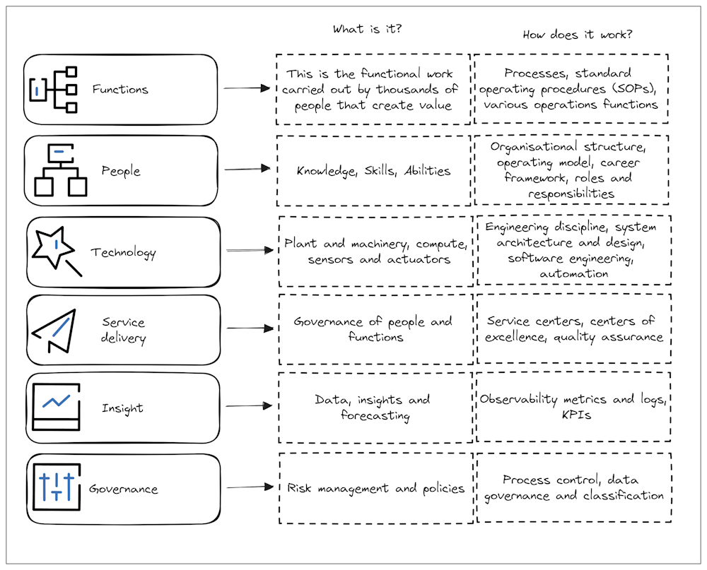

# Chapter 7: 20th Century tools

This chapter aims to introduce the strategist to some modern 20th and 21st century tools that can be useful in the creation of a strategy in preparation for the next chapter which will describe how to create a strategy.

## Domain Driven Design

Domain driven design (DDD) proposes that problems in software or organisations should be segregated from each other and considered in relative isolation. Once the individual problem areas are well understood the relationships between them can be modelled. If these relationships are strong enough they may cause a rethink of that segregation. This continues until there is a workable model for considering the overall domain as a series of individual problems, known as Bounded Contexts. The term comes from Domain Driven Design a 2003, book by Eric Evans.

DDD was inspired by Object Oriented Programming (OOP). This isn’t a programming book so for our purposes OOP can be thought of as thinking about the function of software alongside a model of the data the functions will process. Testing these functions requires a representation of the data, they cannot be tested in isolation. This maps well to organisational problems because at the organisational level we’re often concerned with processes and teams that transform data. A finance function that takes people, software, infrastructure, facilities costs and sales data and turns them into a balance sheet is a great example of a bounded context. They need relationships with a lot of other bounded contexts in order to get the data they need and they have sophisticated tools for processing that data. They have a few key outputs that support the organisation's budgeting processes and quarterly and end of year statements needed by the board and investors to judge the health of the organisation.

DDD provides a tool to examine the problems an organisation is trying to solve from many different angles. DDD then provides a mechanism to consider how those different problems might be grouped together and separated from each other in a variety of different ways in an attempt to identify a useful organisational structure optimised to solve the problems the business faces.

DDD presents the strategist with a simple way to analyse a complex set of problems in an organisation or an entire organisation in a data driven way. There is room in this analysis for intuition and opinion and even biases but it’s very easy to test whether the ideas arising from those will have a positive or negative impact. Once the bounded contexts and the relationships between them are understood it is possible to reorganise them and test the impacts of this reorganisation by analysing how the relationships change and how many problems are encapsulated by each bounded context. This way an organisation structure can be optimised for the problems the business wants to solve. The weaknesses that then follow from this optimisation process can also be assessed in advance of any actual changes and managed.

My preferred approach is to start from a technical angle. I like to start by grouping problems together if changes to one necessitates changes to another. This is an attempt to limit how tightly coupled the relationships are. An example of this would be grouping together Customer Relationship Management (CRM) problems alongside Customer Communications and Marketing. Changes to the CRM system and data will almost inevitably necessitate changes to communications and marketing. However CRM changes are unlikely to impact how an organisation provisions and configures its hosting infrastructure. So that problem can be separated from CRM, Communications and Marketing. However it is possible that a new CRM system might need new infrastructure capabilities so there’s a relationship to be managed but there would be very little advantage to creating a team to tackle CRM, Marketing and Communications and Infrastructure so we can be content with grouping CRM, Communications and Marketing into a Bounded Context together and taking note of the relationship to infrastructure.

In DDD we rinse and repeat this process going through all the problems an organisation faces or all that it wants to tackle. Having applied the lens of grouping problems together based on where changes in one necessitate changes to another we then take another pass. The second pass might consider the skills needed to work with each problem space. That might highlight that the CRM and the Marketing systems might require completely different skill sets. This allows us to choose whether we want to change one of those systems to allow them both to be managed by the same team or whether we want to outsource one or more of those systems so they aren’t our problem to solve anymore or whether we accept that we need a polyglot team to manage both of them or we might choose to split them up and manage them with different teams. Other examples of lenses we might use to analyse these problems include but aren’t limited to:

- Alignment to a particular business function
- Whether it’s a business differentiator or an essential capability
- The data needed to support the function and the author of that data
- The customers or beneficiaries of the solutions

Everytime the team takes a pass over the problem spaces it gets faster to validate or invalidate the approach.

It’s a tough exercise but if the right stakeholders are present and a little pre-work to gather all the problem areas together is completed beforehand multiple passes can be taken in a day.

The enormous advantage of using DDD to help design an organisation is that the justification for the reorganisation emerges from the exercise itself making it significantly easier to explain the reasons for the re-organisation to the board and the individuals affected most by it.

Until 2022 Marks and Spencer’s technology organisation was largely structured around projects. When a problem was prioritised and assigned a budget a software solution would be chosen and a team built around that solution. Occasionally a larger solution was implemented that might cross several team’s boundaries and that might lead to some decommissioning and some teams might merge into a larger team. Unchecked this approach will quickly devolve into chaos, Marks and Spencer is a big place with devolved budget authority and it would be very easy for departments to solve the same problem multiple times.

 In 2022 the enterprise architecture team and the most senior software engineers engaged in a Domain Driven Design exercise. The purpose of the exercise was to use their extensive retail and domain knowledge to get ahead of the problems. Rather than wait for problems to be prioritised this group would look to the next few years and identify the most important and most urgent problems and propose teams be built around solving those problems rather than being built around supporting software solutions that had been chosen to solve the problems. This, in turn, provided the opportunity to make some strategic decisions around programming languages, frameworks and infrastructure that allowed Marks and Spencer to standardise some aspects of its technology allowing it to build recruitment pipelines for building their own teams. This also allowed for the creation of platforms that could reduce the work of the teams building these new systems. All of this brings medium term efficiency and cost saving opportunities that just aren’t available when each problem is considered in isolation and then customised to fit the situation. This is only possible if DDD is combined with the inverse Conway manoeuvre.

## Conway's Law and the inverse Conway manoeuvre

This sounds like something out of Star Trek but it’s the name given to a statement made by a real software engineer named Melvin Conway. In 1967 Conway wrote: Any organisation that designs a system (defined broadly) will produce a design whose structure is a copy of the organisation's communication structure (https://en.wikipedia.org/wiki/Conway%27s_law).

Dubbed Conway’s law this observation has been tested and reinterpreted many times. There’s a commonly accepted extension to the law that for a long-lived piece of software its architecture comes to resemble every iteration of the organisation structure that created it.

A very simplistic interpretation of this tells us that if we have a web team and a backend team and a database team our software architecture will likely have a separate web service, backend service and some databases. Regardless of what we want the software to do.

More specifically if that database team are all Oracle experts you’re likely to have Oracle databases whether that’s the best solution or not.

It’s important to remember though, Conway never said that system architecture will reflect the organisation structure. In simple cases it probably will but Conway said the system design will be a copy of the organisation's communication structure. This has much broader implications than merely the organisation structure.

A common debate in the industry at the moment is whether websites should be built in a monorepo or with many repositories. The debate has several technical angles, but technology is not the major outcome of this decision. In a monorepo all the code for the site is merged into one code repository. No matter how many teams are working on it they merge all their code together. This brings several technical advantages. It’s simple to build shared components just once and have every component, page and site have access to them. Standards can be implemented in one place and be universally applied. End to end tests can be executed in the build pipeline and test every page and interaction required regardless of which team built it.

All of these wonderful advantages become more difficult to achieve when building a site in many repos. A common pattern is for each page to be in its own repository. There are usually smaller, simpler pages that don’t undergo as much change and they might be grouped together. When each page or a group of pages each have their own repository they can’t easily share components with each other. There are some approaches to help with this but they all require additional technology to build them and they all require maintenance. If an end-to-end test is required it needs to be built outside of the flow of building each page, it’s an additional overhead with additional costs and a maintenance burden. Standards have to be applied to each repository, again this requires a solution either copying and pasting standards into each repo and trying to keep them all up-to-date or building some technical solution to apply those standards.

The cost of a monorepo is that engineers wanting to make changes to the site need to merge their code with all the rest of the code. While they are trying to do this all the other engineers are trying to merge their code too. Only one version of the codebase can be authoritative at one time so only one merge can happen at once. This creates what’s called a merge queue and means some engineers will need to rebase their local version of the code and try merging again. In an organisation with lots of engineers this can lead to frustrating delays of several hours.

There is a simple non-technical solution to this problem. The engineers can all get in a chat channel and announce when they want to merge and discuss with each other, the order they want to merge in to ensure urgent changes are made first and high profile changes get a little extra attention.

If you’re not an engineer this might sound like a great solution and I think you’d be right. Engineers tend to hate the very idea of this. This is often considered to be friction. This gets in the way of the engineering workflow. This is an example of Conway’s law in action. If an organisation values its engineers talking to each other and taking a shared responsibility for the site and helping each other they might choose to mandate a monorepo solution because one shared communication channel for all the engineers, mirrors one shared codebase that all the engineers work on and take accountability for. This is what we built at Zoopla, for precisely these reasons, we wanted a culture of sharing, collaboration and mutual support.

The Inverse Conway manoeuvre was created by Jonny LeRoy and Matt Simons in a 2010 article in the Cutter IT journal. The Inverse Conway manoeuvre describes a process whereby an organisation is designed or reorganised  specifically to build and support a particular software architecture.

Just Eat circa 2016 were a great example of this, as with many successful technology organisations Just Eat had built a software monolith but unlike many other technology companies Just Eat actually managed to decompose their monolith. Just Eat formed their teams around the major components they wanted in their platform. There was a Search team, a Menu team, a Restaurant team etc. and each team built what they needed to in order to achieve the KPIs they agreed to meet and the features they agreed to provide. The advantage of this approach is that there were a whole host of problems that could be left up to the teams to resolve that didn’t require any centralised decision making. The downside of this approach is that no one team was accountable for the quality of the platform as a whole. Resolving that problem involved creating several new teams who could identify where a problem needed resolution and were empowered to get the relevant team to resolve that problem. There was the service management team who, amongst other things, helped teams understand how their cloud costs were changing and helped run initiatives to reduce costs. There was an operations centre team who actively monitored the service and the platform during peak hours and highlighted anomalies that needed to be investigated. They, later, took on a function of helping check that new services entering production were ready for production loads. There were several Site Reliability Engineering teams that developed tools for the teams to use to manage their deployments, observability and security.

Conway's Law and the Inverse Conway Manoeuvre can both be tested backwards and forwards. It is possible to draw a system architecture and compare it to the organisations communication structure and flows and see where they match and where they don't. Likewise, once an organisation's communication patterns are understood a software architecture can be designed. This provides the strategist with a great opportunity to test their ideas. If the architecture required doesn't match the communications patterns then the strategist knows that the architecture will not stay as it is for long. Human communications are much more resistent to change than software which can be modified in a couple of hours by a persistent engineer who is offended by what they see as unecessary friction.

## The OODA Loop

The OODA Loop was created by Colonel John Boyd, a US Air Force fighter pilot. Colonel Boyd recognised that rapid decision making was essential in aerial combat and larger, longer running military operations. The OODA loop is a decision making framework that has come to be a staple in legal, political and military strategy.

The success of any large undertaking requires rapid, good quality decisions to ensure momentum is gained and retained and opportunities can be taken advantage of and risks are managed, before they develop a momentum that can pose a significant threat.

The OODA loop defines good decision making as a loop. Each action taken creates new situations which, in turn, require actions to be taken or may cause adversaries to take action which, in turn, necessitate further actions.

One complete loop requires an observation, orientation of that observation in a wider context, a decision about what to do about the observed situation and an action taken.

The idea behind the OODA loop is that if a full cycle of the loop can be traversed faster than the situation observed can evolve then the situation can be mitigated and resolved through good decision making. Proponents of the OODA loop maintain that if two full cycles of the loop can be traversed before the situation being observed can evolve then the situation will resolve itself because it won’t have the opportunity to impact the strategy.

Making good observations can be an extremely complicated and expensive activity in its own right. In technology we often need to buy observability tools, and we certainly need to spend a significant amount of time configuring tools and configuring our applications to be able to provide these tools with the right data so we can observe the behaviour of our applications. We also need to provide the costs for running the applications to the finance organisation so it can be determined whether the application is profitable.

This is just for simple technical solutions. It’s even more complicated to observe teams to determine what they are doing and how well they are doing it.

One of the principals of the agile development movement was to break work down into smaller deliverables so that they can be scoped, tackled and delivered in a few weeks. Delivered in this case means demonstrating what was learned and what was built to the stakeholders so they can confirm the team is on the right track or provide feedback to allow the team to correct their course, so the products eventually created meet stakeholder expectations.

The logic behind this principle seems to have been lost. Engineering teams seem to do sprints for their own sake or adopt kanban so they don’t feel pressured to work to a fixed timescale. Technology leaders ask for ways to measure productivity and velocity when the ultimate measure of this is to judge what a team has learned and achieved over a period of time. Team demos where they show their stakeholders what they have scoped and built and learned are the ultimate measure of productivity. If a team is deemed to be underperforming, based on stakeholder expectations the stakeholders should review the demo and talk to the team to determine what friction they’re experiencing and help to remove that friction or reset their expectations.

If we do all of this right we can know that our applications are functioning,  how well they are performing for the customer and we can know whether our teams are functioning and what friction they are experiencing.

The next question is how well our products are meeting our customers' needs. That’s where user research, product management and product design come in.

If those functions are established and have the people, skills and resources they need then combined with the technical and functional data we can observe our applications and their performance.

As can be seen above, simply making observations is expensive, difficult and time consuming. Orienting those observations in a wider context is uncertain, speculative and, very likely, contentious.

Observation is difficult and expensive and we have direct access to the people, processes and technologies that we need information about. We seldom have direct access to information about the environment our organisations are operating in, the state and plans or our competitors, the latest, relevant developments in the industry, the needs of our customers, shareholders and investors and the state of third party systems we’re dependant on such as customers phones and computers that they  run our applications on.

Orientation requires a continual process of observation and speculation about the operating environment, industry, politics and technology so there is a background of information that can be used to orient a specific observation.

If an observation, oriented in context, requires action a decision must be taken describing what that action should be. There can be a reasonable degree of certainty about the observations. There is much less certainty around the orientation so decisions are never certain to produce the desired outcome. This means every decision carries risk. If an organisation has not taken care to create a system that empowers good decision making then a decision will require meeting after meeting. In an extreme case those meetings continue until the options diminish to one and then a decision is forced on the organisation. Many organisations accept this as decision making when actually decisions are not being taken at all.

There are many ways to facilitate good decision making in an organisation. There can be a structural approach where the organisation structure is associated with levels of authority and accountability. This creates a benign dictatorship where decisions effectively sit with an individual. This doesn’t preclude the leaders of these organisations establishing their own decision making systems, including committees, purchasing advice or anything else but it does force accountability for the outcomes of decisions. There are systemic solutions where decision-making processes are agreed upon in advance and then accountability for the outcome of decisions is shared between those accountable for the decision-making systems and those responsible for executing the processes. A common example of a systemic approach to decision making is a  hiring panel or a scoring matrix for selecting suppliers.

Deciding to take an action doesn’t resolve the situation being observed. Taking action isn’t a point in time, it's a process in its own right. In technology taking action will likely mean creating or optimising some software, reconfiguring a system or restructuring some data or even building a team to tackle some or all of those actions. This is why it’s important to have accurate observations, a good background of information with which to orient those observations and a rapid and robust approach to decision making. Actually taking action will be expensive and time consuming and will no doubt require more detailed decision making so it’s important to make the right decisions because the wrong decisions will cost the organisation three times. Once in the time taken to make the decision in the first place, a second time to undo whatever mistaken actions were made and a third time to traverse the  loop again.

I mentioned earlier that at the DWP the initiative to bring a centralised approach to DevOps and Public Cloud faced two groups of adversaries. The first and most obvious group of adversaries were the teams trying to bring services to citizens and I’ve described how their adversarial nature was born from past experience and a desire to do the right thing and not be held up by unnecessary bureaucracy. The second and less obvious adversary was the CTO. The threat he posed to us was distraction. As his calendar allowed he would come into the department to check up on us and ensure we were making good progress towards his grand strategy. Unfortunately alongside this diligence came a passion for technology and a lack of awareness for how powerful his voice was. While receiving the demos and getting excited for the progress he would ask if we had plans to implement this technology or that technology and our leadership felt compelled to tell him we would and rather than delivering what we had scoped to the people who needed it we would be distracted by those requests.

My solution to this problem was the OODA loop. I didn’t have the authority or the opportunity to work with the CTO directly, the DWP was very hierarchical so I couldn’t counsel him or manage his enthusiasm. What I could do was implement a framework for observation, orientation, decision making and action. We expanded our relationships, we learned what technologies were being discussed, we oriented those observations against the backdrop of our next priorities and our capabilities. We made sure that we took action to have some useful demonstrable capability that would allow us to conclude any conversation about additional scope.

The next time the CTO came by to check out our progress and asked us if we had plans to be able to deploy Docker containers. We had already spoken to the team in Pensions who were speculating about Docker and the Universal Credit team that had spiked it and we had an alpha version ready to present. We were able to repeat this successfully several times.

It can be argued that the OODA loop isn’t a strategy; that it’s a tool for decision making. As described above many organisations are so poor at decision making that, for them, implementing an OODA loop is a first strategy they need to implement because without that no other strategy could be executed.

OODA loops can be tested just as easily as an organisations existing OODA loop can be identified. The advantage of testing the OODA loop is that it's helpful to face the organisation with the decisions it's made about decision making. For example if the CEO needs to sign off on every spend over 50,000 and the organisation needs to do that 10x a year then it's easy to see that with a normal CEO calendar it will require a herculean effort to chase down that sign-off. That can then lead to a productive conversation about whether the sign-off amount should changed, whether sign-off authority should be devolved, whether an improved sign-off process is required or whether that is an appropriate amount of friction given the current state of the business.

## Two way doors

Strategies allow a great deal of flexibility. Within a strategy it can be possible to adapt to new information and if that new information informs the solution and not the problem tactics can be adapted leaving the strategy intact and still relevant.

A great example of this adaptability is two way doors. A two way door describes a decision that can be made that can be changed later without having to undo or redo a lot of work. A great example of a two way door in technology is whether to build a monolith or a microservice architecture when building a new piece of software. The mistake many people make when thinking about this is considering only the most extreme examples of these two architectures. They imagine a monolith that has been modified and adapted, under pressure, for years. They imagine a mess of unpredictable dependencies that are impractical to test. Failing that, they imagine hundreds of serverless functions and containers orchestrated in undocumented ways with one or two functions in each so that it’s impossible to track a single transaction through the system.

Two way doors is a great pattern to use to architect a system to have the right level of scalability and accountability.

For best results use domain driven design to break a big problem into smaller problems that are appropriately isolated from one another. However even if you haven’t done this you can still build a good architecture your decisions will just be slightly less well informed.

When considering a problem that requires a software solution and considering what kind of solution to provide there are a few guiding principles the strategist can use to try and walk a sensible line between monolith and microservices.

A sequence diagram will expose all the steps that need to be taken into account. The sequence diagram should expose certain points in the transaction where the next action can be performed asynchronously or when the next step in the transaction deals with a completely different set of responsibilities. These sorts of things would likely be coded quite differently if they were in a monolith and can be considered fracture planes where a new service could take over the transaction.

Consider a typical ecommerce flow. The customer has loaded up their basket. The customer chooses to check out and has an opportunity to continue as a guest or login. Regardless of their choice we want the flow to continue seamlessly. This means we need to store the state of the basket somewhere while the user authenticates or provides their billing and delivery address data. Once that choice is made and the relevant details stored or looked up the customer can be presented with the delivery costs for their basket and an option to enter any discount codes.

There are a lot of different types of activities going on here for a single user and a specific transaction they are attempting to perform. If this were a monolith each of these separate activities could be coded by different engineers and they would need to agree to some conventions between them such as the names of the variables for storing all this different data and whether to persist it in a cookie, some server-side data store or just leave it in memory. Exactly the same decisions need to be made in a monolith or a microservice implementation. The trick in either case is to have a single piece of code be responsible for a single discrete activity that is easily identifiable using terms, the customer, and non-technical stakeholders would use (DDD proponents call this ubiquitous language). Each of these individual, identifiable responsibilities could be a new microservice or just another file in the monolith.

If all of this is true then the choice whether to build a monolith or build microservices is a two way door. At any time the engineers could choose to combine several microservices together to form a monolith or equally they could split the files up into microservices.

The hard part is maintaining the discipline in a monolith such that it could become a microservice implementation and maintaining appropriate single responsibility design decisions such that the microservices could be combined at some point.

Combining DDD and the inverse Conway manoeuvre helps the strategist identify exactly what problems need to be solved and provides an organisational structure that can solve those problems. In addition it creates the first draft of a high-level system architecture diagram that can be tested by engineers. Adding the OODA loop into the strategy provides a way to quickly respond to the difficulties that will arise as the environment changes or hidden problems are uncovered.

Combined DDD, taking Conway’s Law into account and designing for a rapid OODA loop can be considered a template for designing an operating model for an organisation.

## Target Operating model

The end goal of all of this work should be an operating model that describes how the people, processes and technologies work together to deliver the right products to customers at the right costs and quality levels and what data and insights they generate and need and how all of it is governed.

Target operating models need to take 6 things into account:

Operating models are useful because they allow the strategist to talk about how value is generated without having to discuss individual people and their teams. The functions, how many people and what skills they might have, the technology needed, how services will be delivered and to what standards, the data needed to inform future decision making and the necessary governance can all be discussed safely without any reference to individuals at all.

Once an operating model exists it can then be tested with as many real-world cases as necessary to give people confidence that it will provide the required results.

It's not uncommon in larger organisations for budget processes to have created a pressure that has meant functions are in silos and capabilities are duplicated across the organisation. Operating models will clearly identify that duplication. The decision can then be made to determine what to do about that. If it's felt that a single centralised solution might be preferable an operating model can be created and tested to determine what impact that might have on productivbity.

The most important thing about operating models is using them to test the implications of proposed changes. It's very easy, as a strategist, to get blinded by your genius ideas. Target Operating Models allow those who sceptical of your genius to try out ideas for themselves.

Once an operating model has been chosen then an organisational structure can be designed. Organisational structures can also be tested in a similar way and from organisational structures can flow career frameworks and job specifications and that very quickly leads to execution.

## Conclusion

This chapter has provided the reader with a number of useful tools that will help in the creation of a strategy. More importantly it has presented how each of the tools can be tested to help provide a level of confidence in the strategy and to provide some results to help defend the strategy once it has been created.